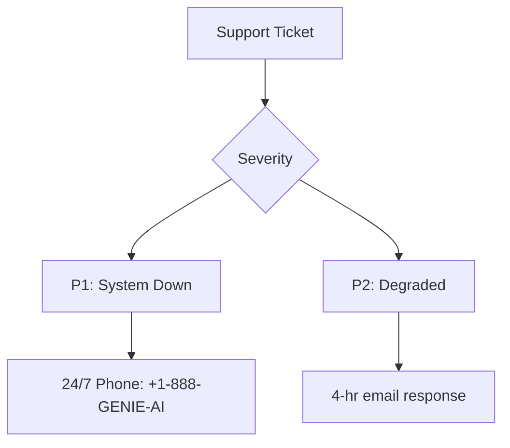
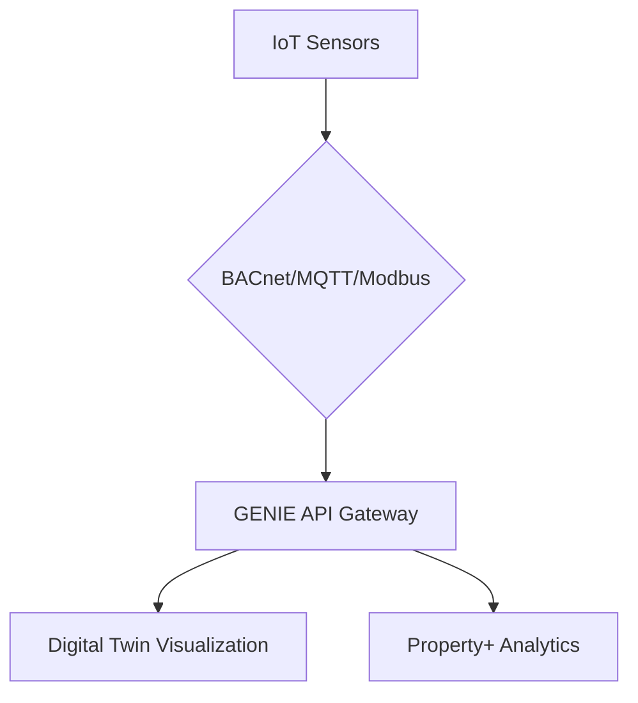

## **Core Principles: Hardware-Free, Scalable, Web-Native**

**Objective:** Leverage your existing IT infrastructure to enable rapid deployment — no proprietary hardware required.

### **✔️ Initial Readiness Checklist:**

- **Hardware Audit**
  - Inventory all existing devices (PCs, tablets, IoT gateways).
  - Ensure stable internet access: _minimum 10 Mbps upload speed per site_.
- **Browser Compatibility**
  - Validate system access on:
    - Google Chrome v115+
    - Microsoft Edge v110+
    - Safari v16+
- **API Integration Request**
  - Email `integrations@genieai.com` with:
    - Existing API documentation (ERP, CMMS, BMS, etc.)
    - Outbound IP ranges for whitelisting

✅ No custom hardware. Web access enables instant scaling across multiple sites.

---

## **2\. Deployment Options: Cloud-Managed or On-Premise**

### **Option A: GENIE Cloud (Recommended)**

**Timeline: 48 hours from contract signature**

- **Step 1: Agreement & Provisioning**
  - Sign standard Cloud Services Agreement.
  - Receive secure admin credentials within 2 business days.
- **Step 2: Data Migration**
  - Upload properties, documents, and historical records via encrypted portal (AES-256).
- **Step 3: Environment Access**
  - Log in to your enterprise dashboard: `https://portal.genieai.cloud`

---

### **Option B: On-Premise Deployment**

**Recommended for high-security or regulatory-restricted environments**

- **Minimum Hardware Specifications:**

| Component      | Requirement                             |
| -------------- | --------------------------------------- |
| CPU            | 16-core, dual-node HA setup             |
| RAM            | 64 GB per node                          |
| Storage        | 1 TB NVMe SSD (RAID 10 preferred)       |
| GPU (for Twin) | NVIDIA RTX A5000 or equivalent          |
| OS             | Ubuntu 20.04 LTS / Windows Server 2019+ |

**Run automated installer:**

curl \-sSL https://install.genieai.com | bash \-s \-- \--key=YOUR_LICENSE_KEY

- **Network Configuration:**
  - Open ports:
    - `443` (HTTPS)
    - `1883` (MQTT)
    - `47808` (BACnet)
  - Configure firewall rules for GENIE secure services.

---

## **3\. IoT Sensor Integration: Streamlined 4-Step Process**

**Objective:** Enable real-time operational awareness via sensor data visualization and analytics.

### **🔗 Steps:**

1. **Sensor Inventory & Data Submission**
   - Complete GENIE’s IoT Template with:
     - Manufacturer and model
     - Protocol (e.g., MQTT, BACnet, Modbus)
     - Sample data schema
2. **API Gateway Configuration**
   - GENIE provides secured API endpoints. Example:

```python
# Example MQTT listener
client = mqtt.Client()
client.connect("iot.genieai.cloud", 1883)
```

3. **Sensor Mapping**
   - Use drag-and-drop tool to link live sensors to 3D floor plan or digital twin coordinates.
4. **Threshold Configuration**
   - Define rule-based alerts:
     - IF temperature \> 30°C THEN send SMS \+ dashboard alert

Supported Protocols:



---

## **4\. API Connectivity: ERP, CMMS & Building Systems**

**Goal:** Integrate Property+ with enterprise platforms to centralize operations.

### **🧪 Sandbox Testing**

- Endpoint: `https://api-sandbox.genieai.dev`
- Credentials:
```json
{  
 "client_id": "test_user", 
 "client_secret": "test_pass"  
}
```
### **🚀 Production Deployment**

- GENIE team provisions:
  - OAuth 2.0 credentials
  - API rate limits (e.g., 1000 req/min)
  - Access logs and monitoring

### **🔁 Webhook Configuration**

```json 
{
 "event": "maintenance_request",  
 "target_url": "https://your-erp.com/webhook"  
}
```

---

## **5\. Web Access & Security: Role-Based and Enterprise Ready**

**Objective:** Ensure secure, compliant access for users across roles and facilities.

### **👥 User Roles & Permissions**

| Role             | Permissions                           |
| ---------------- | ------------------------------------- |
| Admin            | Full control over system and settings |
| Facility Manager | Manage alerts, maintenance, analytics |
| Technician       | Execute tasks, update job statuses    |
| Tenant           | Submit/view unit-specific requests    |

### **🔐 Enterprise Authentication**

- **SSO Integration** (SAML 2.0)
  - Compatible with Azure AD, Okta, Google Workspace
  - Provide SAML metadata; enablement within 24 hours
- **Security Features**
  - IP Whitelisting
  - MFA Enforcement
  - Auto Session Timeout (15 mins configurable)

---

## **6\. Implementation Timeline**

| Phase    | Key Milestone             | Client Actions                        |
| -------- | ------------------------- | ------------------------------------- |
| Week 1–2 | Discovery & API Mapping   | Share documentation, schedule kickoff |
| Week 3–5 | Development & Integration | Validate sandbox data, QA endpoints   |
| Week 6   | UAT & Final QA            | Approve production go-live            |
| Week 7   | Launch \+ Training        | Schedule onboarding for end-users     |

---

## **7\. Support & Maintenance**

- ### GENIE Cloud: 24/7 monitoring \+ SLA (99.95% uptime)

- ### On-Premises: Business-hours support with 4-hour response

- ### Updates: Quarterly feature releases, backward-compatible APIs

### **🧩 Monitoring & Status**

- Real-time system status: `https://status.genieai.com`

### **🔄 Updates**

- **Cloud:** Automatic updates Saturdays, 2–4 AM local
- **On-Premise:** Quarterly scheduled maintenance (client-coordinated)

### **📈 Escalation & SLAs**

- Tiered response plans based on severity
- Emergency line and escalation chart available in admin portal

**Escalation Path**:



---

## **✅ Next Steps Checklist**

- Complete Integration Readiness Form
- Schedule Kickoff Call → Book Here
- Whitelist GENIE IPs: `52.32.18.0/24`
- Submit API \+ Sensor Documentation
- Assign Internal “Integration Champion”

_92% of GENIE clients go live in under 7 weeks using this framework._

---

**For assistance at any stage, contact:**  
📧 integrations@genieai.com  
🔒 Secure portal & configuration templates available upon request
